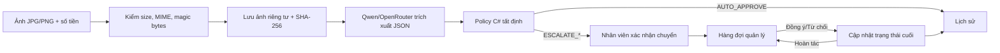

# AURA — Workflow đặc tả sản phẩm

Phiên bản: 1.1 — 24/09/2026
Phạm vi: Sprint 1, Track A — The Escalation Referee

## 1. Mục tiêu và nguyên tắc kiểm soát

AURA hỗ trợ hoàn ứng chi phí theo nguyên tắc **AI đọc dữ kiện, policy quyết định, con người xử lý ngoại lệ**. Qwen vision qua OpenRouter không có quyền phê duyệt. `PolicyDecisionEngine` mới tạo trạng thái nghiệp vụ theo quy tắc tất định và thứ tự ưu tiên `FACT → POLICY → AUTHORITY`.

Ba vai trò demo:

- **Nhân viên:** tải chứng từ, nhập số tiền yêu cầu, xem kết quả, chuyển hồ sơ ngoại lệ.
- **Quản lý:** trả lời câu hỏi cụ thể bằng Đồng ý/Từ chối.
- **Người kiểm toán/BGK:** xem một dòng tổng hợp cho mỗi hồ sơ và mở toàn bộ timeline sự kiện.

## 2. Sơ đồ luồng chính

## 3. Workflow A — Phân tích một chứng từ mới

1. Trình duyệt chỉ nhận một JPG/PNG tối đa 5 MB và hiển thị preview ngay khi chọn.
2. Nhân viên nhập số tiền đề nghị hoàn ứng lớn hơn 0.
3. Client gửi `POST /Applicant/UploadReceipt` bằng `fetch` kèm antiforgery token; trang không reload.
4. Server kiểm extension, MIME, kích thước và magic bytes.
5. Server đặt tên file bằng GUID, lưu ngoài `wwwroot`, tính SHA-256 và kiểm ảnh trùng.
6. Chế độ demo vẫn cho phép ảnh trùng; cờ trùng được ghi nhận. Production có thể bật `DecisionPolicy:EscalateDuplicateReceipts=true`.
7. Qwen đọc ảnh và trả `ReceiptExtractionDto` theo JSON Schema: loại chứng từ, người bán, mã truy vết, ngày, tổng tiền, tiền tệ, trạng thái, line items, warnings và suspicious signals.
8. Policy C# đối chiếu dữ kiện và số tiền khai báo:
   - dữ kiện đáng tin cậy, đúng policy và trong thẩm quyền → `AUTO_APPROVE`;
   - thiếu/mâu thuẫn dữ kiện → `ESCALATE_FACT`;
   - ngoài chính sách → `ESCALATE_POLICY`;
   - vượt thẩm quyền → `ESCALATE_AUTHORITY`;
   - AI/provider lỗi → `ESCALATE_SYSTEM_ERROR`.
9. Hồ sơ, metadata, facts, trạng thái và sự kiện AI đầu tiên được lưu cùng một lần `SaveChanges`.
10. UI cập nhật preview, khung “Nội dung AI đọc được”, bảng kết quả, bộ đếm và lịch sử bằng các vùng HTML trả về từ server.

## 4. Workflow B — Verify Harness 5 ca

1. Người dùng bấm **Chạy Verify Harness** một lần.
2. `POST /Verify/RunHarness` đọc đúng 5 ca từ `wwwroot/test_data/expected-results.json`: 3 ca thường quy và 2 ca chuyển tiếp.
3. Các ảnh chạy tuần tự, cách nhau 4 giây để giảm nguy cơ rate limit.
4. Mỗi ca đi qua cùng extractor và policy production; bảng hiển thị expected, actual, PASS/FAIL, lý do, câu hỏi, latency và timestamp.
5. Khi gặp lỗi provider mang tính hệ thống/quota/schema, harness dừng gọi AI cho các ca còn lại để bảo vệ credit; các ca sau nhận `ESCALATE_SYSTEM_ERROR`, không tạo PASS giả.
6. Sau khi hoàn tất, giao diện tự cuộn đến bảng kết quả. Các ca chuyển tiếp vẫn cần nhân viên xác nhận trước khi xuất hiện ở tab quản lý.

## 5. Workflow C — Human-in-the-loop

### 5.1 Nhân viên chuyển tiếp

- Nút **Chuyển tiếp** xử lý một hồ sơ; **Chuyển tiếp tất cả** xử lý các hồ sơ escalation chưa gửi.
- Server chỉ chấp nhận trạng thái `ESCALATE_*` và thao tác có antiforgery token.
- Hồ sơ được đánh dấu `IsForwardedToManager=true`, lưu `ForwardedAt` và thêm sự kiện `EMPLOYEE_FORWARDED_TO_MANAGER`.
- Sau khi server commit, trình duyệt điều hướng sang tab Quản lý và dựng lại toàn bộ bảng từ database. Cách này ưu tiên trạng thái nhất quán hơn cập nhật nhiều fragment hoặc polling nền.

### 5.2 Quản lý quyết định

| Trạng thái gốc | Đồng ý | Từ chối |
|---|---|---|
| `ESCALATE_FACT` | `MANUAL_REVIEW_ACCEPTED` | `RETURNED_FOR_MORE_EVIDENCE` |
| `ESCALATE_POLICY` | `APPROVED_POLICY_EXCEPTION` | `REJECTED_POLICY_EXCEPTION` |
| `ESCALATE_AUTHORITY` | `FORWARDED_TO_AUTHORITY` | `RETURNED_BY_MANAGER` |
| `ESCALATE_SYSTEM_ERROR` | `MANUAL_REVIEW_ACCEPTED` | `RETURNED_FOR_RETRY` |

Mỗi quyết định lưu câu hỏi, câu trả lời, kết quả và thời gian trong cùng transaction cập nhật hồ sơ.

### 5.3 Hoàn tác

- Chỉ quyết định quản lý gần nhất mới được hoàn tác.
- Hệ thống tra sự kiện AI/Verify ban đầu để khôi phục đúng loại `ESCALATE_*`.
- `ManagerAnswer` và `ManagerDecisionAt` được xóa; sự kiện `MANAGER_UNDO` được thêm vào timeline.

## 6. Workflow D — Audit nhất quán

`AuditLogs` là **event log append-only ở tầng ứng dụng**: không sửa hay xóa lịch sử cũ. Việc AI xử lý, nhân viên chuyển và quản lý quyết định là ba sự kiện khác nhau, không phải ba bản sao hồ sơ.

Để UI không gây cảm giác trùng:

- nhóm mọi event theo `RequestId`;
- hiển thị đúng một dòng cho mỗi hồ sơ;
- “Thao tác cuối” và “Trạng thái hiện tại” lấy từ event/hồ sơ mới nhất;
- nút mở rộng hiển thị timeline đầy đủ theo thời gian.

Cách này vừa giữ bằng chứng để truy vết/hoàn tác, vừa tránh ghi đè log gốc và tránh ba dòng giống nhau trên màn hình.

## 7. Đồng bộ và điều hướng

- Upload và Verify dùng `fetch` để giữ nguyên workspace trong lúc AI chạy và cập nhật các vùng kết quả liên quan.
- Chuyển tiếp, quyết định quản lý và hoàn tác dùng `fetch` để nhận lỗi có cấu trúc, sau đó điều hướng toàn trang tới tab đích khi thành công. Mọi bảng vì vậy được dựng lại từ trạng thái database đã commit.
- Không có polling nền, WebSocket hoặc SignalR trong Sprint 1. Nếu một tab khác đã mở từ trước, người dùng tải lại hoặc chọn lại tab để lấy trạng thái mới.
- `WorkflowOperationGate` từ chối thao tác ghi chồng trong một tiến trình; SQL Server `RowVersion` phát hiện cập nhật đồng thời giữa nhiều tiến trình và trả lỗi conflict thay vì ghi đè âm thầm.
- `GET /Applicant/Receipt/{id}` tải ảnh theo ID, không nhận đường dẫn từ client và đặt `NoStore`.

## 8. Nhánh lỗi và nguyên tắc fail-safe

| Sự cố | Hành vi |
|---|---|
| Ảnh sai loại/quá 5 MB | Chặn trước AI, báo lỗi rõ |
| API key/model sai | `ESCALATE_SYSTEM_ERROR`, kiểm thủ công |
| HTTP 429/hết credit | Không retry, dừng harness còn lại |
| HTTP 5xx | Retry tối đa một lần; vẫn lỗi thì chuyển thủ công |
| JSON/schema không hợp lệ | Parser cố chuẩn hóa giới hạn; thất bại thì chuyển thủ công |
| Ảnh mơ hồ/prompt injection | Thêm suspicious signal; FACT có ưu tiên cao nhất |
| File mất nhưng DB còn | Route trả 404; cần storage bền khi deploy |

AURA hiện **không có circuit breaker tổng quát** và **không triển khai exponential backoff nhiều lần**. Cơ chế hiện hữu là một retry giới hạn cho 5xx, không retry 429, cùng quota guard của Verify Harness.

## 9. Dữ liệu thật và dữ liệu mô phỏng

- Chạy thật: upload, OpenRouter/Qwen, policy C#, SQL Server, audit, human decision và receipt retrieval.
- Mô phỏng: 30 ảnh tổng hợp sinh offline; 5 ảnh Verify và manifest 15 ca BGK được tuyển từ ngân hàng này.
- Không dùng hóa đơn cá nhân thật trong Git. Ảnh thật tùy chọn chỉ đặt tại `test_kit/local_real` và bị `.gitignore` loại trừ.

## 10. Giới hạn Sprint 1

Chưa có authentication/role, PDF/nhiều trang, antivirus, tax/e-invoice lookup, ngoại tệ, object storage, SignalR, immutable audit ở tầng database, rate limiting public endpoint và benchmark trên tập dữ liệu độc lập lớn. Đây là các hạng mục Sprint 2, không được mô tả như tính năng hiện có.
