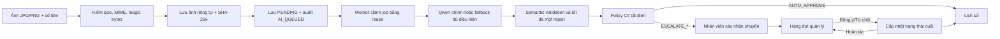

# AURA — Workflow đặc tả sản phẩm

Phiên bản: 2.0 — 06/10/2026
Phạm vi: baseline Sprint 1 và hardening chuẩn bị Sprint 2, Track A — The Escalation Referee

## 1. Mục tiêu và nguyên tắc kiểm soát

AURA hỗ trợ hoàn ứng chi phí theo nguyên tắc **AI đọc dữ kiện, policy quyết định, con người xử lý ngoại lệ**. Qwen vision không có quyền phê duyệt. OpenRouter 8B là provider chính; Ollama 4B local là fallback có kiểm soát nhưng mặc định tắt. `PolicyDecisionEngine` tạo trạng thái nghiệp vụ theo quy tắc tất định và thứ tự ưu tiên `FACT → POLICY → AUTHORITY`.

Ba vai trò demo:

- **Nhân viên:** tải chứng từ, nhập số tiền yêu cầu, xem kết quả, chuyển hồ sơ ngoại lệ.
- **Quản lý:** trả lời câu hỏi cụ thể bằng Đồng ý/Từ chối.
- **Người kiểm toán/BGK:** xem một dòng tổng hợp cho mỗi hồ sơ và mở toàn bộ timeline sự kiện.

## 2. Sơ đồ luồng chính

```mermaid
flowchart LR
    A[Ảnh JPG/PNG + số tiền] --> B[Kiểm size, MIME, magic bytes]
    B --> C[Lưu ảnh riêng tư + SHA-256]
    C --> Q[Lưu PENDING + audit AI_QUEUED]
    Q --> W[Worker claim job bằng lease]
    W --> D[Qwen chính hoặc fallback đủ điều kiện]
    D --> V[Semantic validation và tối đa một repair]
    V --> E[Policy C# tất định]
    E -->|AUTO_APPROVE| F[Lịch sử]
    E -->|ESCALATE_*| G[Nhân viên xác nhận chuyển]
    G --> H[Hàng đợi quản lý]
    H -->|Đồng ý/Từ chối| I[Cập nhật trạng thái cuối]
    I --> F
    I -->|Hoàn tác| H
```

## 3. Workflow A — Phân tích một chứng từ mới

1. Trình duyệt chỉ nhận một JPG/PNG tối đa 5 MB và hiển thị preview ngay khi chọn.
2. Nhân viên nhập số tiền đề nghị hoàn ứng lớn hơn 0.
3. Client gửi `POST /Applicant/UploadReceipt` bằng `fetch` kèm antiforgery token và ngữ cảnh người gửi; trang không reload.
4. Server kiểm extension, MIME, kích thước và magic bytes.
5. Server đặt tên file bằng GUID, lưu ngoài `wwwroot`, tính SHA-256 và kiểm ảnh trùng.
6. Chế độ demo vẫn cho phép ảnh trùng; cờ trùng được ghi nhận. Production có thể bật `DecisionPolicy:EscalateDuplicateReceipts=true`.
7. Server commit hồ sơ `PENDING` cùng audit `AI_QUEUED`, trả `202 Accepted` và `statusUrl`; UI không giữ request HTTP trong lúc AI suy luận.
8. Worker claim job bằng update có điều kiện, đặt lease và tăng attempt. DB là nguồn sự thật nên job còn lại sau refresh hoặc app restart.
9. Qwen đọc ảnh và trả `ReceiptExtractionDto`. Khi bật fallback, chỉ lỗi hạ tầng trong allowlist mới chuyển một lần sang provider dự phòng; schema/semantic/request invalid không kích hoạt fallback.
10. Backend kiểm tra semantic trước policy bằng evidence contract v2. Mỗi kết quả mới phải có chuỗi ngày nguyên văn và provenance của số tiền cuối; chỉ `PRINTED_FINAL_TOTAL` cùng dòng evidence chứa đúng nhãn/số in trực tiếp mới có thể tự duyệt. Dòng Total bị cắt/rách, số chỉ suy từ subtotal/items, evidence thiếu hoặc không khớp đều repair tối đa một lần rồi `ESCALATE_FACT`. Backend chuẩn hóa lossless `HH:mm:ss`/AM-PM về `HH:mm` và ngày Việt Nam day-first từ chuỗi gốc; vì vậy `09:46:21` không che nhánh POLICY và `04-10-26` không bị hiểu thành 10/04. VND chính là số nguyên đồng, nhưng VAT đã được in là bao gồm có thể giữ phần lẻ hỗ trợ và không được cộng lần hai. Tiền khách đưa, tiền thối, VAT đã gồm, điểm/tích lũy không phải discount/total. Hóa đơn giấy phải có ít nhất một hàng hóa/dịch vụ đọc được; vùng món bị che/mờ/cắt hoặc `lineItems=[]` không chứng minh “không có hạng mục cấm”. `invoiceNumber`, `receiptNumber`, `transactionReference` được tách khỏi Mã CQT, serial, số chứng từ và POS; PTT trên phiếu tính tiền là `receiptNumber`. Facts lưu repair metadata; lỗi còn lại luôn fail-safe.
11. Policy C# đối chiếu dữ kiện và số tiền khai báo:
   - dữ kiện đáng tin cậy, đúng policy và trong thẩm quyền → `AUTO_APPROVE`;
   - thiếu/mâu thuẫn dữ kiện → `ESCALATE_FACT`; nếu đồng thời có hạng mục cấm, lý do vẫn hiển thị policy finding thứ cấp để quản lý không bỏ sót;
   - ngoài chính sách → `ESCALATE_POLICY`;
   - vượt thẩm quyền → `ESCALATE_AUTHORITY`;
   - AI/provider lỗi → `ESCALATE_SYSTEM_ERROR`.
12. Worker lưu facts, quyết định, latency, provider chính/provider phục vụ, fallback flag và sự kiện audit trong một lần `SaveChanges`.
13. UI poll `GET /Applicant/Status/{id}` mỗi giây. `sessionStorage` giữ status URL để tiếp tục theo dõi sau refresh trong cùng tab.

## 4. Workflow B — Verify Harness 5 ca

1. Người dùng bấm **Chạy Verify Harness** một lần.
2. `POST /Verify/RunHarness` đọc đúng 5 ca từ `wwwroot/test_data/expected-results.json`: 3 ca thường quy và 2 ca chuyển tiếp.
3. Các ảnh chạy tuần tự, cách nhau 4 giây để giảm nguy cơ rate limit.
4. Mỗi ca đi qua cùng extractor và policy production; bảng hiển thị expected, actual, PASS/FAIL, lý do, câu hỏi, latency và timestamp.
5. Khi gặp lỗi provider mang tính hệ thống/quota/schema, harness dừng gọi AI cho các ca còn lại để bảo vệ credit; các ca sau nhận `ESCALATE_SYSTEM_ERROR`, không tạo PASS giả.
6. Sau khi hoàn tất, giao diện tự cuộn đến bảng kết quả. Các ca chuyển tiếp vẫn cần nhân viên xác nhận trước khi xuất hiện ở tab quản lý.

## 5. Workflow C — Human-in-the-loop

### 5.1 Nhân viên chuyển tiếp

- Nút **Chuyển tiếp** xử lý một hồ sơ; **Chuyển tiếp tất cả** xử lý các hồ sơ escalation chưa gửi.
- Server chỉ chấp nhận trạng thái `ESCALATE_*` và thao tác có antiforgery token.
- Hồ sơ được đánh dấu `IsForwardedToManager=true`, lưu `ForwardedAt` và thêm sự kiện `EMPLOYEE_FORWARDED_TO_MANAGER`.
- Sau khi server commit, trình duyệt điều hướng sang tab Quản lý và dựng lại toàn bộ bảng từ database. Cách này ưu tiên trạng thái nhất quán hơn cập nhật nhiều fragment hoặc polling nền.

### 5.2 Quản lý quyết định

| Trạng thái gốc | Đồng ý | Từ chối |
|---|---|---|
| `ESCALATE_FACT` | `MANUAL_REVIEW_ACCEPTED` | `RETURNED_FOR_MORE_EVIDENCE` |
| `ESCALATE_POLICY` | `APPROVED_POLICY_EXCEPTION` | `REJECTED_POLICY_EXCEPTION` |
| `ESCALATE_AUTHORITY` | `FORWARDED_TO_AUTHORITY` | `RETURNED_BY_MANAGER` |
| `ESCALATE_SYSTEM_ERROR` | `MANUAL_REVIEW_ACCEPTED` | `RETURNED_FOR_RETRY` |

Mỗi quyết định lưu câu hỏi, câu trả lời, kết quả và thời gian trong cùng transaction cập nhật hồ sơ.

### 5.3 Hoàn tác

- Chỉ quyết định quản lý gần nhất mới được hoàn tác.
- Hệ thống tra sự kiện AI/Verify ban đầu để khôi phục đúng loại `ESCALATE_*`.
- `ManagerAnswer` và `ManagerDecisionAt` được xóa; sự kiện `MANAGER_UNDO` được thêm vào timeline.

## 6. Workflow D — Audit nhất quán

`AuditLogs` là **event log append-only ở tầng ứng dụng**: không sửa hay xóa lịch sử cũ. Việc AI xử lý, nhân viên chuyển và quản lý quyết định là ba sự kiện khác nhau, không phải ba bản sao hồ sơ.

Để UI không gây cảm giác trùng:

- nhóm mọi event theo `RequestId`;
- hiển thị đúng một dòng cho mỗi hồ sơ;
- “Thao tác cuối” và “Trạng thái hiện tại” lấy từ event/hồ sơ mới nhất;
- nút mở rộng hiển thị timeline đầy đủ theo thời gian.

Timestamp được lưu UTC. Giao diện Audit chuyển rõ sang timezone Việt Nam (UTC+7) bằng mapping Windows/Linux; không dùng `DateTime.ToLocalTime()` vì timezone của máy hosting có thể khác người dùng.

Cách này vừa giữ bằng chứng để truy vết/hoàn tác, vừa tránh ghi đè log gốc và tránh ba dòng giống nhau trên màn hình.

## 7. Đồng bộ và điều hướng

- Upload trả `202` rồi poll status; Verify vẫn dùng một request tuần tự để giữ đúng baseline 5 ca.
- Đánh giá mở rộng 15/30 ca chạy bằng PowerShell runner ngoài UI. Mỗi ca vẫn đi qua upload endpoint, queue, vision, policy và audit; dashboard không có thêm nút batch.
- Chuyển tiếp, quyết định quản lý và hoàn tác dùng `fetch` để nhận lỗi có cấu trúc, sau đó điều hướng toàn trang tới tab đích khi thành công. Mọi bảng vì vậy được dựng lại từ trạng thái database đã commit.
- Polling chỉ theo dõi hồ sơ upload của tab hiện tại. Chưa có SignalR để đẩy thay đổi cross-tab cho bảng quản lý/audit.
- Upload, chuyển tiếp và quyết định không dùng global gate. `WorkflowOperationGate` chỉ ngăn hai Verify batch chạy chồng; `RowVersion` phát hiện hai thao tác cùng sửa một hồ sơ.
- `GET /Applicant/Receipt/{id}` tải ảnh theo ID, không nhận đường dẫn từ client và đặt `NoStore`.

## 8. Nhánh lỗi và nguyên tắc fail-safe

| Sự cố | Hành vi |
|---|---|
| Ảnh sai loại/quá 5 MB | Chặn trước AI, báo lỗi rõ |
| API key/model sai | `ESCALATE_SYSTEM_ERROR`, kiểm thủ công |
| HTTP 429/hết credit | Không retry, dừng harness còn lại |
| HTTP 5xx | Retry tối đa một lần; vẫn lỗi thì chuyển thủ công |
| JSON/schema không hợp lệ | Parser cố chuẩn hóa giới hạn; thất bại thì chuyển thủ công |
| JSON đúng schema nhưng tự mâu thuẫn | Đọc lại đúng một lần; vẫn sai thì `ESCALATE_FACT`, không tự sửa theo claim |
| Ảnh mơ hồ/prompt injection | Thêm suspicious signal; FACT có ưu tiên cao nhất |
| File mất nhưng DB còn | Route trả 404; cần storage bền khi deploy |
| Provider chính lỗi hạ tầng và fallback bật | Gọi fallback đúng một lần; audit provider thực sự phục vụ |
| Provider chính lỗi semantic/schema/request | Không fallback; fail-safe để tránh che lỗi dữ liệu/contract |
| App restart khi job đang chạy | Lease hết hạn rồi worker reclaim; UI có thể tiếp tục poll bằng status URL |

AURA có circuit breaker trong bộ nhớ theo instance. Sau ngưỡng lỗi hạ tầng liên tiếp, request mới dùng fallback trong thời gian cooldown; hết cooldown, provider chính được probe lại. Hệ thống không fallback cho mọi lỗi. Riêng lỗi truy cập SQL của worker dùng exponential backoff có trần 60 giây để tránh bão log; đây là cơ chế phục hồi hàng đợi, không phải retry Vision AI.

## 9. Dữ liệu thật và dữ liệu mô phỏng

- Chạy thật baseline: upload, semantic validator, policy C#, SQL Server, audit, human decision và receipt retrieval. Trên judge set 15 ca với fallback tắt, OpenRouter/Qwen 8B lịch sử đạt 15/15 quyết định, 70/75 field và P95 16,459 giây. Ollama/Qwen 4B lịch sử đạt 14/15; lượt post-policy/contract v2 ngày 06/10 đạt 13/15, 56/75 field, P95 136,758 giây, vẫn bỏ sót TK-12 và thêm over TK-02. Vì vậy 4B không đạt safety gate; GPU BTC/8B là benchmark mới, không phải baseline đã pass. Cả hai kết quả synthetic không phải production accuracy.
- Cổng regression sau guard ngày 02/10: Phê La bị che vùng món trả `ESCALATE_FACT`; Vinamilk đủ bảy dòng hàng và phép tính giảm giá trả `AUTO_APPROVE`; Official Verify 5/5; restart giữ status/facts/ảnh/audit; manager YES/NO/UNDO có audit; concurrent smoke hoàn tất 5/5 với accepted P95 530 ms và end-to-end P95 39,380 giây. Đây vẫn là evidence phạm vi nhỏ, không thay holdout thực tế đa dạng.
- Development validation bổ sung: Oppa `AUTO_APPROVE` sau một repair, Texas `AUTO_APPROVE` không repair và Phê La che món `ESCALATE_FACT`. Fallback regression bằng DB riêng xác minh `OpenRouter → Ollama`, `FallbackUsed=true`, E2E 84,425 giây. Hai nhóm này là evidence kỹ thuật, không thay blind holdout hoặc safety gate Ollama.
- Deployment postfix trên `c42c5ef` đóng automated technical gate: health/DB/storage/migration, initial-tab, security-negative, AUTO + FACT smoke độc lập, Verify 5/5, human workflow, persistence và 2 + 5 concurrent request pass. Mobile 390 px vẫn partial; blind holdout, ba user session, manual 4G/no-flash và rehearsal vẫn là final gate.
- Official blind holdout thật ngày 06/10 đã chạy đúng một lượt, fallback tắt và raw evidence giữ bất biến: 10/15 decision đúng (66,67%), 1 missed escalation, 3 over-escalation, 0 system error. Review post-hoc chỉ sửa cách diễn giải, không sửa raw: BH-04 thực tế in ngày Chủ nhật nên adjusted view 11/15 (73,33%), 1/10 missed escalation và 2/5 over-escalation. Field 28/30 chỉ đo `currency` + `totalAmount`, không phải full extraction accuracy. Kết luận là NO-GO cho accuracy claim/unattended pilot; 15 ảnh này từ đây chỉ là post-holdout regression, muốn có blind claim mới phải dùng ảnh unseen mới.
- Post-holdout Test Kit v3 synthetic được khóa hash/ground truth ở namespace riêng và chạy đúng một live batch: 11/15 decision, 142/145 field, 0 system error, P50/P95 9,235/37,917 giây. Raw không thay thế v2/holdout. Mismatch tạo ra hardening deterministic context-aware cho OCR `Bìa`→`Bia`, short alphabetic receipt fragment không đủ truy vết và revision v3.1 sửa precondition Số biên nhận/Số chứng từ; candidate 133/133 test pass, live v3.1 còn chờ publish.
- Hậu holdout P0/P1 ngày 06/10 bổ sung contract v2 cho dòng tổng/ngày gốc, chuẩn hóa giây/AM-PM, money-role guard, mapping PTT/Mã CQT, taxonomy kẹp tóc/khăn ướt và UI hiển thị provenance. `1f4b3c9` đã live và đạt health 5/5, security 6/6, UI browser mobile 390 px, Verify 5/5 và workflow fixture 2/2 (policy reject/undo, fact approve/undo). Bản vá Audit UTC→giờ Việt Nam đã được xác minh trên live; checkpoint đạt 122/122 test. Điện thoại thật 4G/5G và user/rehearsal là gate còn lại.
- Mô phỏng: 30 ảnh tổng hợp sinh offline; 5 ảnh Verify và manifest 15 ca BGK được tuyển từ ngân hàng này.
- Ground truth tổng hợp được sinh tất định bằng Python/Pillow và khóa trong manifest. Ảnh generative AI không được dùng làm nhãn chuẩn; hóa đơn thật đã ẩn danh chỉ nằm trong holdout cục bộ ngoài Git.
- Không dùng hóa đơn cá nhân thật trong Git. Ảnh thật tùy chọn chỉ đặt tại `test_kit/local_real` và bị `.gitignore` loại trừ.

## 10. Giới hạn hiện tại

Chưa có authentication/role thật, trường mục đích công tác/khách hàng/cost center để phân biệt một khoản cà phê cá nhân với khoản tiếp khách, PDF/nhiều trang, antivirus, tax/e-invoice lookup, ngoại tệ, object storage, SignalR, immutable audit ở tầng database, distributed circuit breaker, rate limiting public endpoint và benchmark trên tập dữ liệu độc lập lớn. Ba trường người gửi là metadata demo, không phải danh tính đã xác thực. Image resize chưa bật trước khi có benchmark chứng minh không làm giảm khả năng đọc chữ nhỏ. Hệ thống không tự suy “chi cá nhân” từ tên món nếu policy doanh nghiệp chưa cung cấp context và danh mục được duyệt.
